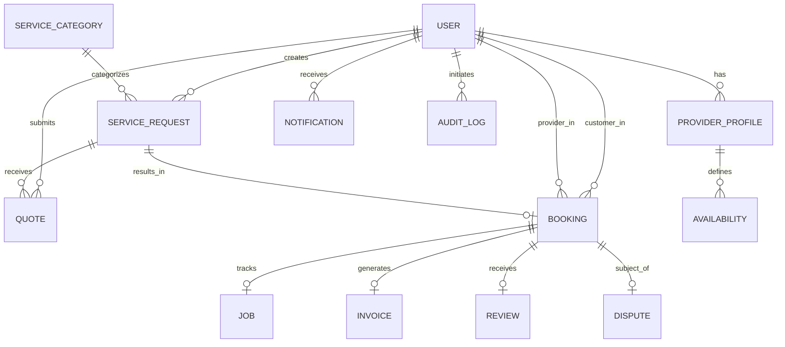

# CareConnect Database Design & Data Architecture

## 1. Overview

CareConnect utilizes MongoDB with Mongoose ODM to model an event-driven, multi-role marketplace and operations platform. The database architecture balances relational referential integrity (using Mongoose `ObjectId` references) with document-oriented embedding for operational snapshots (e.g. frozen addresses and invoice line items).

---

## 2. Entity Relationship Overview

---

## 3. Data Dictionary & Collections

### 1. `users`
Represents all system actors across the 5 system roles.
- `_id`: ObjectId (Primary Key)
- `name`: String (Required, trimmed, min: 2, max: 100)
- `email`: String (Required, unique, indexed, lowercase)
- `passwordHash`: String (Bcrypt salt rounds 12, select: false)
- `phone`: String (Optional)
- `role`: Enum [`CUSTOMER`, `SERVICE_PROVIDER`, `SUPPORT_AGENT`, `OPERATIONS_MANAGER`, `PLATFORM_ADMIN`]
- `status`: Enum [`ACTIVE`, `PENDING_VERIFICATION`, `SUSPENDED`]
- `createdAt`, `updatedAt`: Timestamps

### 2. `providerprofiles`
Extended operational and business data for `SERVICE_PROVIDER` accounts.
- `user`: ObjectId (Ref: `User`, unique index)
- `businessName`: String
- `description`: String
- `skills`: Array of String
- `serviceAreas`: Array of String (Postal codes / city names)
- `experienceYears`: Number (min: 0)
- `hourlyRate`: Number (min: 0)
- `verificationStatus`: Enum [`UNVERIFIED`, `PENDING`, `VERIFIED`, `REJECTED`]
- `documents`: Array of `{ documentType, fileUrl, verifiedAt }`
- `rating`: Number (0.0 to 5.0, default: 0)
- `reviewCount`: Number (default: 0)
- `isAvailable`: Boolean (Indexed)

### 3. `servicecategories`
Configurable home service classifications.
- `name`: String (Unique)
- `slug`: String (Unique, indexed, e.g. `plumbing`, `appliance-repair`)
- `description`: String
- `icon`: String
- `isActive`: Boolean (Indexed)
- `basePriceEstimate`: Number

### 4. `servicerequests`
Home service requests posted by Customers.
- `customer`: ObjectId (Ref: `User`, indexed)
- `category`: ObjectId (Ref: `ServiceCategory`, indexed)
- `title`: String
- `description`: String
- `location`: `{ address, city, state, postalCode, coordinates: [lng, lat] }` (2dsphere index)
- `preferredDate`: Date
- `preferredTimeSlot`: String (`MORNING`, `AFTERNOON`, `EVENING`)
- `requiredSkills`: Array of String
- `status`: Enum [`DRAFT`, `SUBMITTED`, `MATCHING`, `QUOTED`, `BOOKED`, `CANCELLED`, `COMPLETED`]
- `aiClassification`: `{ predictedCategory, confidenceScore, extractedUrgency, tags, processedAt }`

### 5. `quotes`
Bids and formal price quotes submitted by Providers for Service Requests.
- `serviceRequest`: ObjectId (Ref: `ServiceRequest`, indexed)
- `provider`: ObjectId (Ref: `User`, indexed)
- `estimatedPrice`: Number (Required)
- `estimatedDurationHours`: Number
- `message`: String
- `status`: Enum [`PENDING`, `ACCEPTED`, `REJECTED`, `EXPIRED`]
- `expiresAt`: Date

### 6. `bookings`
Legally binding service contracts resulting from accepted quotes.
- `serviceRequest`: ObjectId (Ref: `ServiceRequest`, indexed)
- `customer`: ObjectId (Ref: `User`, indexed)
- `provider`: ObjectId (Ref: `User`, indexed)
- `quote`: ObjectId (Ref: `Quote`)
- `scheduledStart`: Date (Required)
- `scheduledEnd`: Date (Required)
- `price`: Number (Required)
- `status`: Enum [`CONFIRMED`, `IN_PROGRESS`, `COMPLETED`, `CANCELLED`, `DISPUTED`]
- `cancellation`: `{ cancelledBy, cancelledAt, reason, refundAmount }`

### 7. `availabilities`
Weekly schedules, recurring shift windows, and blackout dates for Providers.
- `provider`: ObjectId (Ref: `User`, indexed)
- `dayOfWeek`: Number (0 = Sunday to 6 = Saturday)
- `startTime`: String (`09:00`)
- `endTime`: String (`17:00`)
- `isBlocked`: Boolean
- `blockedDate`: Date

### 8. `jobs`
Real-time fulfillment tracking, check-ins, service evidence, and job notes.
- `booking`: ObjectId (Ref: `Booking`, unique indexed)
- `provider`: ObjectId (Ref: `User`, indexed)
- `customer`: ObjectId (Ref: `User`, indexed)
- `status`: Enum [`SCHEDULED`, `DISPATCHED`, `ON_SITE`, `IN_PROGRESS`, `WORK_DONE`, `INVOICED`, `CLOSED`]
- `startedAt`, `completedAt`: Date
- `serviceEvidence`: Array of `{ url, description, uploadedAt }`
- `notes`: String

### 9. `invoices`
Financial accounting, payment records, and fee breakdowns.
- `invoiceNumber`: String (Unique index, e.g. `INV-2026-0001`)
- `booking`: ObjectId (Ref: `Booking`, indexed)
- `customer`: ObjectId (Ref: `User`)
- `provider`: ObjectId (Ref: `User`)
- `subtotal`: Number
- `platformFee`: Number
- `tax`: Number
- `totalAmount`: Number
- `status`: Enum [`ISSUED`, `PAID`, `REFUNDED`, `VOID`]
- `paidAt`: Date

### 10. `reviews`
Verified feedback submitted by customers after job completion.
- `booking`: ObjectId (Ref: `Booking`, unique index)
- `customer`: ObjectId (Ref: `User`, indexed)
- `provider`: ObjectId (Ref: `User`, indexed)
- `rating`: Number (1 to 5)
- `comment`: String

### 11. `disputes`
Conflict mediation and escrow refund claims.
- `booking`: ObjectId (Ref: `Booking`, indexed)
- `raisedBy`: ObjectId (Ref: `User`, indexed)
- `reason`: String
- `description`: String
- `status`: Enum [`OPEN`, `UNDER_REVIEW`, `RESOLVED`, `ESCALATED`, `DISMISSED`]
- `resolution`: `{ resolvedBy, resolvedAt, resolutionNotes, refundApproved, refundAmount }`

### 12. `notifications`
In-app and push notification event stream.
- `recipient`: ObjectId (Ref: `User`, indexed)
- `title`: String
- `message`: String
- `type`: Enum [`SYSTEM`, `BOOKING`, `QUOTE`, `PAYMENT`, `DISPUTE`]
- `data`: Mixed
- `isRead`: Boolean (Default: false, indexed)

### 13. `auditlogs`
Append-only immutable audit trail for security compliance and governance.
- `actor`: ObjectId (Ref: `User`, indexed)
- `action`: String (e.g. `PROVIDER_VERIFIED`, `DISPUTE_REFUND_ISSUED`)
- `targetType`: String
- `targetId`: ObjectId (Indexed)
- `details`: Mixed
- `ipAddress`: String
- `userAgent`: String
- `createdAt`: Date (Indexed)

---

## 4. Indexing & Optimization Strategy

1. **Unique Indices**:
   - `users.email`
   - `providerprofiles.user`
   - `servicecategories.slug`
   - `jobs.booking`
   - `invoices.invoiceNumber`
   - `reviews.booking`
2. **Compound & Query Indices**:
   - `servicerequests`: `{ customer: 1, status: 1 }`, `{ category: 1, status: 1 }`
   - `bookings`: `{ customer: 1, status: 1 }`, `{ provider: 1, status: 1 }`
   - `availabilities`: `{ provider: 1, dayOfWeek: 1 }`
   - `notifications`: `{ recipient: 1, isRead: 1 }`
3. **Geospatial Indices**:
   - `servicerequests.location.coordinates`: `2dsphere` for distance calculations and radius searching.
