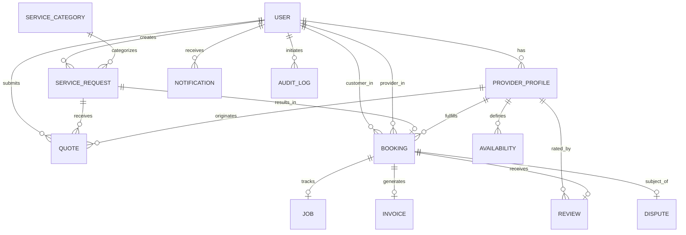

# CareConnect Database Design & Data Architecture

## 1. Overview

CareConnect utilizes MongoDB with Mongoose ODM to model a multi-role marketplace and operations platform. The database architecture balances relational referential integrity (using Mongoose `ObjectId` references) with document-oriented embedding for performance, historical immutability, and transactional clarity.

---

## 2. Entity Relationship Overview



---

## 3. Data Dictionary & Collections

### 1. `users`
Represents all system actors across the 5 system roles.
- `_id`: ObjectId (Primary Key)
- `name`: String (Required, trimmed, min: 2, max: 100)
- `email`: String (Required, unique, indexed, normalized to lowercase)
- `passwordHash`: String (Bcrypt salt rounds 12, `select: false`, stripped from JSON)
- `phone`: String (Optional, trimmed)
- `role`: Enum [`CUSTOMER`, `SERVICE_PROVIDER`, `SUPPORT_AGENT`, `OPERATIONS_MANAGER`, `PLATFORM_ADMIN`]
- `status`: Enum [`ACTIVE`, `INACTIVE`, `SUSPENDED`, `PENDING`]
- `createdAt`, `updatedAt`: Timestamps
- **Indexes**: `{ email: 1 }` (unique), `{ role: 1, status: 1 }`

### 2. `providerprofiles`
Extended operational and business data for `SERVICE_PROVIDER` accounts.
- `user`: ObjectId (Ref: `User`, unique index)
- `businessName`: String
- `description`: String
- `skills`: Array of String
- `serviceAreas`: Array of String (Postal codes / city names)
- `experienceYears`: Number (min: 0)
- `hourlyRate`: Number (min: 0)
- `verificationStatus`: Enum [`UNVERIFIED`, `PENDING`, `VERIFIED`, `REJECTED`]
- `documents`: Array of `{ documentType, fileUrl, verifiedAt }`
- `rating`: Number (0.0 to 5.0, default: 0)
- `reviewCount`: Number (default: 0)
- `isAvailable`: Boolean (Indexed)
- **Indexes**: `{ user: 1 }` (unique), `{ isAvailable: 1 }`, `{ verificationStatus: 1 }`

### 3. `servicecategories`
Configurable home service classifications.
- `name`: String (Unique)
- `slug`: String (Unique, indexed, e.g. `plumbing`, `appliance-repair`)
- `description`: String
- `icon`: String
- `isActive`: Boolean (Indexed)
- `basePriceEstimate`: Number
- **Indexes**: `{ slug: 1 }` (unique), `{ isActive: 1 }`

### 4. `servicerequests`
Home service requests posted by Customers.
- `customer`: ObjectId (Ref: `User`, indexed)
- `category`: ObjectId (Ref: `ServiceCategory`, indexed)
- `title`: String
- `description`: String
- `location`: `{ address, city, state, postalCode, coordinates: [lng, lat] }` (2dsphere index)
- `preferredDate`: Date
- `preferredTimeSlot`: String (`MORNING`, `AFTERNOON`, `EVENING`)
- `requiredSkills`: Array of String
- `status`: Enum [`DRAFT`, `SUBMITTED`, `MATCHING`, `QUOTING`, `PROVIDER_SELECTED`, `BOOKED`, `IN_PROGRESS`, `COMPLETED`, `CANCELLED`, `DISPUTED`]
- `aiClassification`: `{ predictedCategory, confidenceScore, extractedUrgency, tags, processedAt }`
- **Indexes**: `{ customer: 1, status: 1 }`, `{ category: 1, status: 1 }`, `{ coordinates: '2dsphere' }`

### 5. `quotes`
Bids and formal price quotes submitted by Providers for Service Requests.
- `serviceRequest`: ObjectId (Ref: `ServiceRequest`, indexed)
- `provider`: ObjectId (Ref: `User`, indexed)
- `providerProfile`: ObjectId (Ref: `ProviderProfile`, indexed)
- `estimatedPrice`: Number (Required, min: 0)
- `estimatedDurationHours`: Number (default: 1, min: 0.5)
- `message`: String
- `status`: Enum [`SUBMITTED`, `VIEWED`, `ACCEPTED`, `REJECTED`, `EXPIRED`, `WITHDRAWN`]
- `expiresAt`: Date
- **Indexes**: `{ serviceRequest: 1, provider: 1 }`, `{ provider: 1, status: 1 }`

### 6. `bookings`
Legally binding service contracts resulting from accepted quotes.
- `serviceRequest`: ObjectId (Ref: `ServiceRequest`, indexed)
- `customer`: ObjectId (Ref: `User`, indexed)
- `provider`: ObjectId (Ref: `User`, indexed)
- `providerProfile`: ObjectId (Ref: `ProviderProfile`, indexed)
- `quote`: ObjectId (Ref: `Quote`)
- `scheduledStart`: Date (Required, indexed)
- `scheduledEnd`: Date (Required)
- `price`: Number (Required, min: 0)
- `status`: Enum [`PENDING`, `CONFIRMED`, `IN_PROGRESS`, `COMPLETED`, `CANCELLED`, `DISPUTED`]
- `cancellation`: `{ cancelledBy, cancelledAt, reason, refundAmount }`
- **Indexes**: `{ customer: 1, status: 1 }`, `{ provider: 1, status: 1 }`, `{ scheduledStart: 1, status: 1 }`

### 7. `availabilities`
Weekly schedules, recurring shift windows, and blackout dates for Providers.
- `provider`: ObjectId (Ref: `User`, indexed)
- `providerProfile`: ObjectId (Ref: `ProviderProfile`, indexed)
- `dayOfWeek`: Number (0 = Sunday to 6 = Saturday)
- `startTime`: String (`09:00`)
- `endTime`: String (`17:00`)
- `isBlocked`: Boolean (default: false)
- `blockedDate`: Date
- **Indexes**: `{ provider: 1, dayOfWeek: 1 }`, `{ providerProfile: 1, dayOfWeek: 1 }`

### 8. `jobs`
Real-time fulfillment tracking, check-ins, service evidence, and job notes.
- `booking`: ObjectId (Ref: `Booking`, unique indexed)
- `provider`: ObjectId (Ref: `User`, indexed)
- `customer`: ObjectId (Ref: `User`, indexed)
- `status`: Enum [`ASSIGNED`, `ON_THE_WAY`, `CHECKED_IN`, `IN_PROGRESS`, `COMPLETED`, `CANCELLED`]
- `startedAt`, `completedAt`: Date
- `serviceEvidence`: Array of `{ url, description, uploadedAt }`
- `notes`: String
- **Indexes**: `{ booking: 1 }` (unique), `{ provider: 1, status: 1 }`, `{ customer: 1, status: 1 }`

### 9. `invoices`
Financial accounting, payment records, and fee breakdowns.
- `invoiceNumber`: String (Unique index, e.g. `INV-2026-0001`)
- `booking`: ObjectId (Ref: `Booking`, indexed)
- `customer`: ObjectId (Ref: `User`)
- `provider`: ObjectId (Ref: `User`)
- `subtotal`: Number
- `platformFee`: Number
- `tax`: Number
- `totalAmount`: Number
- `status`: Enum [`ISSUED`, `PAID`, `REFUNDED`, `VOID`]
- `paidAt`: Date
- **Indexes**: `{ invoiceNumber: 1 }` (unique), `{ booking: 1 }`

### 10. `reviews`
Verified feedback submitted by customers after job completion.
- `booking`: ObjectId (Ref: `Booking`, unique index)
- `customer`: ObjectId (Ref: `User`, indexed)
- `provider`: ObjectId (Ref: `User`, indexed)
- `providerProfile`: ObjectId (Ref: `ProviderProfile`, indexed)
- `rating`: Number (1 to 5)
- `comment`: String
- **Indexes**: `{ booking: 1 }` (unique), `{ provider: 1, rating: -1 }`, `{ providerProfile: 1, rating: -1 }`

### 11. `disputes`
Conflict mediation and escrow refund claims.
- `booking`: ObjectId (Ref: `Booking`, indexed)
- `raisedBy`: ObjectId (Ref: `User`, indexed)
- `reason`: String
- `description`: String
- `status`: Enum [`OPEN`, `UNDER_REVIEW`, `RESOLVED`, `ESCALATED`, `DISMISSED`]
- `resolution`: `{ resolvedBy, resolvedAt, resolutionNotes, refundApproved, refundAmount }`
- **Indexes**: `{ booking: 1 }`, `{ raisedBy: 1, status: 1 }`

### 12. `notifications`
In-app and push notification event stream.
- `recipient`: ObjectId (Ref: `User`, indexed)
- `title`: String
- `message`: String
- `type`: Enum [`SYSTEM`, `BOOKING`, `QUOTE`, `PAYMENT`, `DISPUTE`]
- `data`: Mixed
- `isRead`: Boolean (Default: false, indexed)
- **Indexes**: `{ recipient: 1, isRead: 1 }`

### 13. `auditlogs`
Append-only immutable audit trail for security compliance and governance.
- `actor`: ObjectId (Ref: `User`, indexed)
- `action`: String (e.g. `PROVIDER_VERIFIED`, `DISPUTE_REFUND_ISSUED`)
- `targetType`: String
- `targetId`: ObjectId (Indexed)
- `details`: Mixed
- `ipAddress`: String
- `userAgent`: String
- `createdAt`: Date (Indexed)
- **Indexes**: `{ actor: 1 }`, `{ targetId: 1 }`, `{ createdAt: -1 }`

---

## 4. Lifecycle State Machine Diagrams

### Service Request Lifecycle
```
[DRAFT] ──> [SUBMITTED] ──> [MATCHING] ──> [QUOTING] ──> [PROVIDER_SELECTED] ──> [BOOKED] ──> [IN_PROGRESS] ──> [COMPLETED]
   │             │              │             │                 │                  │              │                 │
   └─────────────┴──────────────┴─────────────┴─────────────────┴──────────────────┴──────────────┴──────> [CANCELLED]
                                                                                                   │
                                                                                                   └──────> [DISPUTED]
```

### Booking Lifecycle
```
[PENDING] ──> [CONFIRMED] ──> [IN_PROGRESS] ──> [COMPLETED]
    │              │                │                │
    └──────────────┴────────────────┴────────> [CANCELLED]
                                    │                │
                                    └────────> [DISPUTED]
```

### Job Execution Lifecycle
```
[ASSIGNED] ──> [ON_THE_WAY] ──> [CHECKED_IN] ──> [IN_PROGRESS] ──> [COMPLETED]
    │               │                 │                 │
    └───────────────┴─────────────────┴─────────────────┴──────> [CANCELLED]
```
